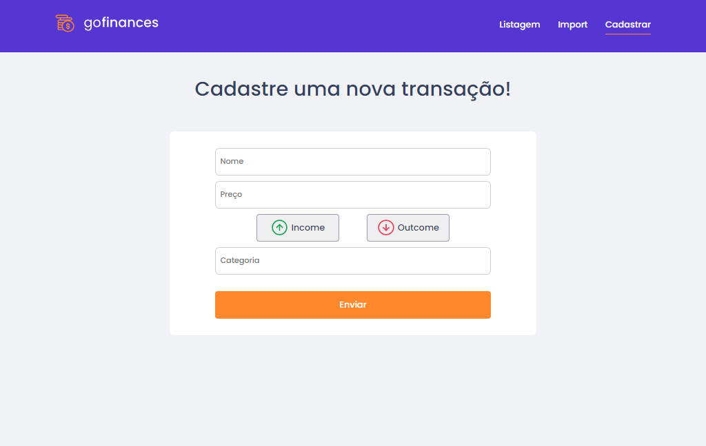

<h1 align="center">GoFinances</h1>
<p align="center">Desafio proposto no GoStack12, aplicação desenvolvida com ReactJS, NodeJS, TypeScript e Styled-components. Onde a aplicação controlava e gerencia a entrada e saída de novas transações.</p>


## Listando entrada e saída de valores
<h1 align="center">
  
</h1>

## Importando arquivo .CSV
<h1 align="center">
  
</h1>

## Cadastrando nova transação
<h1 align="center">
  
</h1>

### 🛠 Tecnologias

As seguintes ferramentas foram usadas na construção do projeto:

- [Node.js](https://nodejs.org/en/)
- [React](https://pt-br.reactjs.org/)
- [TypeScript](https://www.typescriptlang.org/)
- [Docker](https://www.docker.com/)
- [PostgreSql](https://www.postgresql.org/)
- [Styled-components](https://styled-components.com/)

<h1>📱 Como usar?</h1>

### Pré-requisitos

Primeiramente, você precisa ter instalado em sua máquina as seguintes ferramentas:
[Git](https://git-scm.com), [Node.js](https://nodejs.org/en/) e o [Docker](https://www.docker.com/). 
E lógico é bom ter um editor para trabalhar com o código como [VSCode](https://code.visualstudio.com/)

### 🎲 Rodando a aplicação

```bash
# Clone este repositório
$ git clone <https://github.com/caduxl007/gofinances.git>

# Acesse a pasta do projeto no terminal/cmd
$ cd gofinances

# Vá para a pasta server
$ cd backend

# Instale as dependências
$ yarn

# Execute a aplicação em modo de desenvolvimento
$ yarn dev:server

# O servidor inciará na porta:3333 - acesse <http://localhost:3333>

# Após isso navegue a ter a pasta web
$ cd web

Instale as dependências
$ yarn

# Execute a aplicação
$ yarn start

## Prontinho você terá acesso a aplicação!!!
```
