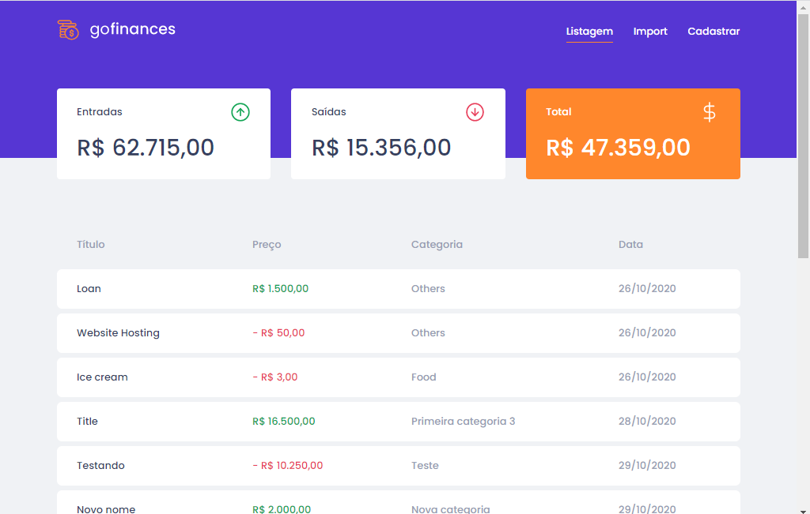
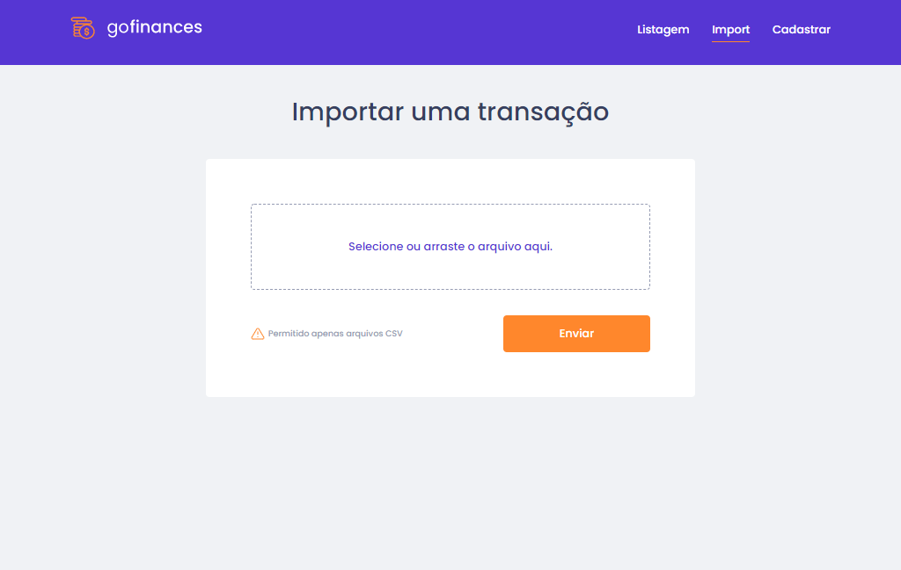

<h1 align="center">GoFinances</h1>

Desafio proposto no GoStack12, aplicação desenvolvida com ReactJS, NodeJS, TypeScript e Styled-components. Onde a aplicação controlava e gerencia a entrada e saída de novas transações.

## Listando entrada e saída de valores
<h1 align="center">
  
</h1>

## Importando arquivo .CSV
<h1 align="center">
  
</h1>

## Cadastrando nova transação
<h1 align="center">
  
</h1>

### 🛠 Tecnologias

As seguintes ferramentas foram usadas na construção do projeto:

- [Node.js](https://nodejs.org/en/)
- [React](https://pt-br.reactjs.org/)
- [React Native](https://reactnative.dev/)
- [TypeScript](https://www.typescriptlang.org/)
- [Docker](https://www.docker.com/)
- [PostgreSql](https://www.postgresql.org/)
